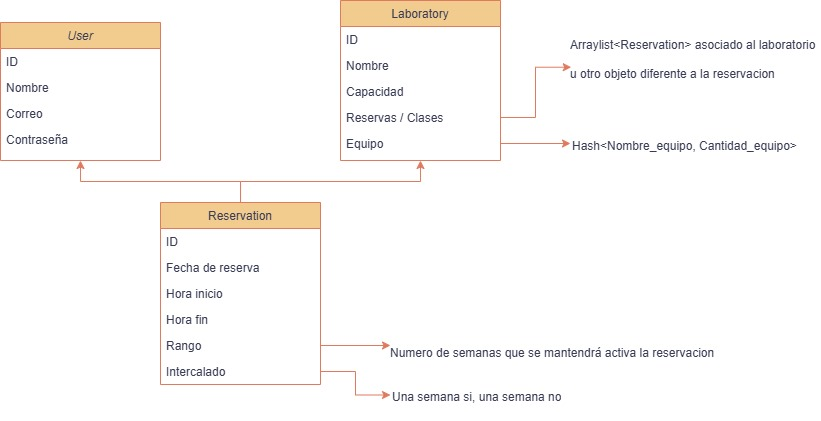

# LABORATORIO 4 - Scrum - DI/IOC
ESCUELA COLOMBIANA DE INGENIERÍA - CICLOS DE VIDA DE DESARROLLO DE SOFTWARE

---

## Integrantes del grupo FENRIR

- Vicente Garzón Rios
- Daniel Alejandro Diaz Camelo
- Geronimo Martinez Nuñez.
- Carlos David Barrero Velasquez.

---

## CASO DE NEGOCIO - SISTEMA DE RESERVAS DE SALONES PARA LA UNIVERSIDAD ESCUELA COLOMBIANA DE INGENIERÍA JULIO GARAVITO.

El proyecto consiste en una aplicación para la gestión de reservas de salones dentro de la Escuela Colombiana de Ingeniería Julio Garavito. Los usuarios podrán consultar la disponibilidad de salones, realizar reservas y cancelar sus reservas desde una interfaz web. La aplicación se conectará a un API REST desarrollado en Spring Boot. El backend permitirá la inyección de dependencias para el manejo de datos, pudiendo optar entre una base de datos en MongoDB Cloud o un archivo de texto plano para almacenar las reservas.

---

## ÉPICAS
1. Backend: Implementar un API REST para el manejo de la lógica de negocio y persistencia de datos.

---

## SPRINTS
Sprint 1: Configuración General del Proyecto

  - Configuración de ambientes (backend y frontend).

  

  - Scaffolding del proyecto.

  
  

  - Configuración de la base de datos (MongoDB Cloud o archivo de texto plano).

  

  - Definición del modelo de datos (salones y reservas).

  

Sprint 2: Implementación del API REST

  - Crear los endpoints necesarios para consultar laboratorios, realizar reservas y cancelar reservas.

  - Implementar la lógica de validación para evitar reservas conflictivas.

  - Configurar la persistencia de datos en MongoDB Cloud o archivo de texto plano.
